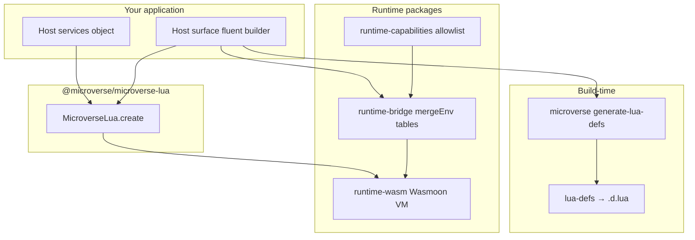

# Microverse

**Typed, sandboxed Lua scripting for TypeScript applications.**

Microverse is a pnpm monorepo for embedding **user-defined behavior** in your product—rules, workflows, promotions, plugins—without redeploying TypeScript for every change. Your app stays the source of truth (databases, billing, auth); Lua scripts run in isolated slots inside a Wasm VM and call back into TypeScript through **declarative bridges** guarded by **capabilities**.

## Why Microverse?

| Need | How Microverse helps |
|------|----------------------|
| Scriptable business logic | Load Lua chunks per tenant, campaign, or entity. |
| Safe host APIs | Each bridge method has Zod input/output and a `domain:action` capability; scripts declare an allowlist at registration. |
| Host → script events | Workflow hooks (`onOrderPlaced`, …) with typed payloads from TypeScript. |
| Good DX in Lua | Generate [LuaCATS](https://luals.github.io/wiki/annotations/) `.d.lua` stubs from the same surface spec that drives runtime. |
| No native Lua install | Lua runs via **Wasmoon** in Node or the browser. |

## Architecture (high level)



1. You define a **host** (your services) and a **surface** (what Lua may call).
2. **`MicroverseLua.create`** opens one shared Wasm Lua VM and manages **script sessions** (one env slot per `scriptId`).
3. At build time, the same surface produces **`.d.lua`** stubs for LuaLS.

Start with the Lua facade: **[`packages/microverse-lua`](packages/microverse-lua/README.md)**.

## Quick start

**Requirements:** Node ≥ 20.10, pnpm 10.

```bash
pnpm install
pnpm build
pnpm test
```

**Consumer entry point** (applications depend on this package only):

```ts
import { MicroverseLua, defineHostSurfaceFor } from '@microverse/microverse-lua';
```

**Generate IDE stubs** (dev dependency):

```bash
pnpm add -D @microverse/cli
pnpm exec microverse generate-lua-defs --surface src/mySurface.ts
```

See the full walkthrough in [`packages/microverse-lua/README.md`](packages/microverse-lua/README.md) and the reference app below.

## Reference example

[`examples/business-scripting-engine`](examples/business-scripting-engine) models an e-commerce **rules engine**:

- **Host** — in-memory orders, billing, notifications, audit, inventory, jobs.
- **Surface** — `businessSurface.ts` (bridges + workflow hooks).
- **Lua** — `lua/workflows/*.lua` react to `OrderPlaced`, charge orders, etc.
- **Engine** — `BusinessScriptingEngine` wraps `MicroverseLua.create`.

```bash
pnpm --filter @microverse-examples/business-scripting-engine test
```

## Monorepo layout

| Path | Role |
|------|------|
| [`packages/microverse-lua`](packages/microverse-lua/README.md) | **Lua facade** — `MicroverseLua`, re-exports, plug-and-play Lua microverse. |
| [`packages/host-surface`](packages/host-surface/README.md) | Fluent `defineHostSurfaceFor`, manifest → bridges + `.d.lua`. |
| [`packages/lua-defs`](packages/lua-defs/README.md) | Manifest → LuaCATS file (library / plugins). |
| [`packages/cli`](packages/cli/README.md) | `microverse` CLI (`generate-lua-defs`, …). |
| `packages/runtime-core` | Runtime ports, slots, timeouts, script execution. |
| `packages/runtime-wasm` | Wasmoon adapter, `mergeEnv`, async bridge policy. |
| `packages/runtime-bridge` | Declarative bridge tables and coordinator. |
| `packages/runtime-capabilities` | Capability registry and allowlists. |
| `packages/runtime-lua` | Lua chunk / mapping types. |
| `packages/runtime-zod` | Zod validation at bridge boundaries. |
| `packages/shared` | Shared types and use-case conventions. |
| `examples/*` | End-to-end samples. |
| `tooling/*` | ESLint, Prettier, TypeScript, Vite presets. |

Packages follow a **layered** layout (`domain` / `application` / `infrastructure`) and `eslint-plugin-boundaries` rules to keep dependencies acyclic.

## Documentation map

| Topic | Where to read |
|-------|----------------|
| What is a Lua microverse? | [`packages/microverse-lua/README.md`](packages/microverse-lua/README.md) |
| Defining surfaces & host | [`packages/host-surface/README.md`](packages/host-surface/README.md) |
| Generating `.d.lua` | [`packages/lua-defs/README.md`](packages/lua-defs/README.md), [`packages/cli/README.md`](packages/cli/README.md) |
| Async bridges & Lua patterns | [`packages/host-surface/docs/async-subroutines-components.md`](packages/host-surface/docs/async-subroutines-components.md) |
| Component-style Lua (props/state) | [`examples/business-scripting-engine/docs/COMPONENT_PATTERN.md`](examples/business-scripting-engine/docs/COMPONENT_PATTERN.md) |

## Scripts (root)

| Command | Description |
|---------|-------------|
| `pnpm build` | Build all packages (Turbo). |
| `pnpm test` | Run tests across the workspace. |
| `pnpm lint` | ESLint. |
| `pnpm typecheck` | TypeScript `--noEmit`. |
| `pnpm format` | Prettier write. |
| `pnpm check:circular` | Madge circular dependency check. |

## License

MIT — see [LICENSE](LICENSE). Published packages live under the [`@microverse`](https://www.npmjs.com/org/microverse) scope on npm; the consumer entry point is [`@microverse/microverse-lua`](https://www.npmjs.com/package/@microverse/microverse-lua).
