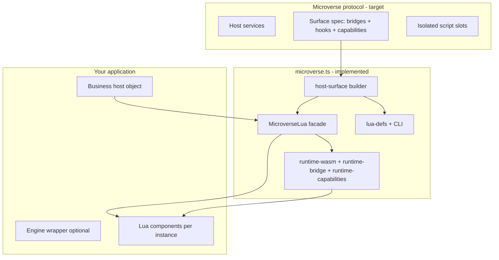

# Microverse

**A protocol-in-progress for sandboxed, domain-specific scripting in applications.**

Microverse is a project under active development. The goal is a **protocol** that lets applications host **microverses**—isolated sandboxes where user or domain logic runs against a **host-defined API** (your DSL), not arbitrary OS or network access. Product teams can model rules, promotions, plugins, and workflows in a scripting language while TypeScript (or another host) keeps databases, billing, auth, and IO.

**Microverse Lua** is the first concrete profile: Lua scripts, declarative **bridges** into your services, **capability** allowlists per script instance, and optional **component hooks** (`onOrderPlaced`, …) for host → script events.

## Today vs aspiration

| | |
|---|---|
| **Implemented now** | **microverse.ts** — this pnpm monorepo. Consumer entry: [`@microverse.ts/microverse-lua`](packages/microverse-lua/README.md). Node ≥ 20 and browser, Wasmoon Lua VM, Zod at bridge boundaries, LuaCATS generation for LuaLS. |
| **Aspiration** | A protocol abstract enough to support **other microverse kinds** (different runtimes or languages) while keeping the same ideas: host services, surface spec, isolated slots, capabilities, and typed host ↔ script events. |

## Why Microverse?

| Need | How Microverse helps |
|------|----------------------|
| Scriptable business logic | Load Lua chunks per tenant, campaign, or entity. |
| Safe host APIs | Each bridge method has Zod input/output and a `domain:action` capability; scripts declare an allowlist at mount. |
| Host → script events | Component hooks (`onOrderPlaced`, …) with typed payloads from TypeScript. |
| Good DX in Lua | Generate [LuaCATS](https://luals.github.io/wiki/annotations/) `.d.lua` stubs from the same surface spec that drives runtime. |
| No native Lua install | Lua runs via **Wasmoon** in Node or the browser. |

## Architecture (high level)



1. You model your **DSL** as a **host surface** (bridge methods + optional `componentHooks`).
2. You pass a **host** object (your real services) and the surface into `MicroverseLua.create`.
3. Each **script instance** gets a Wasm **env slot**, a capability allowlist, and scoped `self.bridges` (bridges are not globals in the slot).
4. The host emits domain events → Lua `on*` methods on every mounted component that implements them.
5. At build time, the same surface produces **`.d.lua`** stubs for LuaLS.

## Live examples (GitHub Pages)

After each push to `main`, CI builds every Vite app under [`examples/`](examples/) and publishes them together:

| Demo | Live | Source |
|------|------|--------|
| **Sorting Lab** — compare two Lua sort algorithms step-by-step | [Open demo](https://qadrax.github.io/Microverse.ts/sorting-lab/) | [`examples/sorting-lab`](examples/sorting-lab) |
| **Chess Lab** — two Lua chess engines duel on one board | [Open demo](https://qadrax.github.io/Microverse.ts/chess-lab/) | [`examples/chess-lab`](examples/chess-lab) |

Index of all published demos: **[https://qadrax.github.io/Microverse.ts/](https://qadrax.github.io/Microverse.ts/)**

Build locally (output in `.github-pages/`):

```bash
pnpm install
pnpm run build:pages
```

To enable Pages on a fork: **Settings → Pages → Build and deployment → GitHub Actions** (workflow [`.github/workflows/pages.yml`](.github/workflows/pages.yml)).

## Documentation

Install, API, Lua authoring, integration, and the reference example: **[`packages/microverse-lua/README.md`](packages/microverse-lua/README.md)**.
