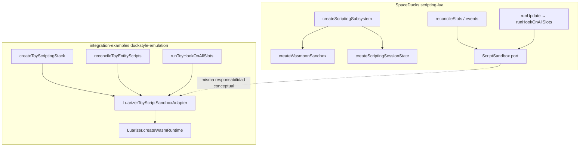

# Emulación Duck-style vs `@duckengine/scripting-lua` + `core-v2`

Este documento enlaza la **arquitectura real** de SpaceDucks v2 con el **demo** en `packages/integration-examples/.../duckstyle-emulation/` y con lo que ofrece **Luarizer** hoy. No sustituye leer el código de Duck; sirve como mapa de migración.

## 1. Capas en SpaceDucks (referencia)

### `core-v2`

- **`createSceneSubsystem(config)`** (`domain/subsystems/createSceneSubsystem.ts`): convierte un config plano en una fábrica `SceneSubsystemFactory` que el runtime de escena invoca con `SceneSubsystemFactoryContext`.
- El config declara **`createState`**, **`events`** (p. ej. `entity-added`, `component-changed`), **`engineEvents`**, **`phases`** (`earlyUpdate`, `update`, …) y **`dispose`**.
- El subsistema resultante es el **punto de montaje** del motor: el juego no llama a Wasmoon directamente; llama a fases y eventos tipados.

### `scripting-lua`

- **`createScriptingSubsystem`** (`infrastructure/scriptingSubsystem.ts`):
  - Crea **un** `createWasmoonSandbox()` → `ScriptSandbox` + `LuaEngine`.
  - Devuelve `createSceneSubsystem({ id: 'scripting-lua', createState, events, engineEvents, phases, dispose })`.
- **`createScriptingSessionState`** resuelve ports (`ResourceCachePort`, `DiagnosticPort`), resolvers de fuente/schema, y delega en **`initializeScriptRuntime`**, que inyecta en Lua `engine_ports`, `Engine` (Input, Gizmo, Physics, Time), etc.
- **Dominio de slots** (`domain/slots/slots.ts`):
  - `slotKey(entityId, scriptId)` → clave estable.
  - `initScriptSlot` → async resolve source/schema → `sandbox.detectHooks` → `sandbox.createSlot` → `callHook('init')` / `onEnable`.
  - `runHookOnAllSlots(slots, sandbox, hook, dt)` → solo slots que declararon el hook y siguen `enabled`.
- **Aplicación** (`application/runUpdate.ts`, …): use cases del subsistema que llaman a `runHookOnAllSlots` con nombres fijos (`'update'`, `'earlyUpdate'`, …).
- **Puerto `ScriptSandbox`** (`domain/ports/scriptSandbox.ts`): contrato **sincrónico** hacia el motor (`callHook` devuelve `boolean`). La implementación real es Wasmoon + Lua (`__LoadSlot`, `__CallHook`, props, dirty flush, …).

## 2. Qué hace Luarizer hoy (relevante para migración)

- **Un VM por `SandboxRuntime`**, muchos **slots** vía `createSandbox({ slotKey })`.
- Cada `sandbox.run({ script })` ejecuta un chunk en un **entorno Lua por slot** (`load` + metatable `__index = _G`), persistido entre ejecuciones del mismo slot.
- **No** existe aún en la librería un `ScriptSandbox` Duck-compatible: no hay `detectHooks`/`createSlot`/`callHook`/`syncProperties`/`flushDirtyProperties` como API única; eso vive hoy **dentro** de `scripting-lua` + Lua embebido.

**Conclusión:** una reescritura de `scripting-lua` puede **mantener** el mismo `ScriptSandbox` (contrato + semántica) e implementarlo **encima** de Luarizer: el adaptador traduce cada operación a una o varias llamadas `sandbox.run` (y, en el futuro, a un bootstrap Lua tipo `__CallHook` si se añade a Luarizer).

## 3. Qué emula la carpeta `duckstyle-emulation/`

| Concepto Duck | Archivo / tipo en la emulación |
|---------------|----------------------------------|
| `EntityId`, escena con entidades | `types.ts`, `toyScene.ts` |
| `slotKey(entityId, scriptId)` | `toySlotState.ts` → `toySlotKey` |
| Map `slots` + `declaredHooks` + `enabled` | `toyScriptingSession.ts` |
| `ScriptSandbox` (subconjunto) | `luarizerToyScriptSandbox.ts` → `ToyScriptSandboxPort` |
| `initScriptSlot` + hooks iniciales | `reconcileToyEntityScripts.ts` |
| `runHookOnAllSlots` | `runToyHookOnAllSlots.ts` |
| `createScriptingSubsystem` (forma) | `toyScriptingSubsystem.ts` → `createToyScriptingStack` |
| Escena de demostración | `duckstyleEmulation.example.ts` |

**Limitaciones explícitas del demo (no son bugs de Luarizer):**

- No hay `@duckengine/core-v2`, ECS real, bridges a Input/Physics, ni `emitSceneChange`.
- `detectHooks` es **heurístico** (regex sobre el fuente); Duck usa análisis coherente con el runtime Lua.
- `callHook` se implementa como **otro** `sandbox.run` con un fragmento Lua que invoca la función del hook; Duck usa una sola VM con `__CallHook` y metatables. Con el entorno por slot de Luarizer, los hooks viven en **`_ENV`**, no en `rawget(_G, …)` (el demo usa `_ENV[h]`).
- `ScriptSandbox` real es **síncrono**; aquí el stack es **async** porque `Sandbox.run` es `Promise` en Luarizer.

## 4. Orden razonable para una reescritura real de `scripting-lua`

1. Extraer interfaces que ya son de dominio (`ScriptSandbox`, tipos de slots) a un paquete **sin** `core-v2` o mantenerlas en `scripting-lua` e implementar **solo** la infraestructura Wasm con `@luarizer/luarizer`.
2. Implementar `ScriptSandbox` con un **adaptador** a `SandboxRuntime` + convención Lua (o ampliar Luarizer con bootstrap `__CallHook` cuando lo defináis).
3. Dejar `createScriptingSubsystem` y los use cases (`runUpdate`, `reconcileSlots`, …) como **orquestación** que importa `core-v2` y el nuevo adaptador.

El demo en `integration-examples` prueba el punto (2) en versión mínima y el encaje (1)+(3) a nivel de **forma** del subsistema.

## 5. Diagrama de flujo (Duck vs demo Luarizer)

