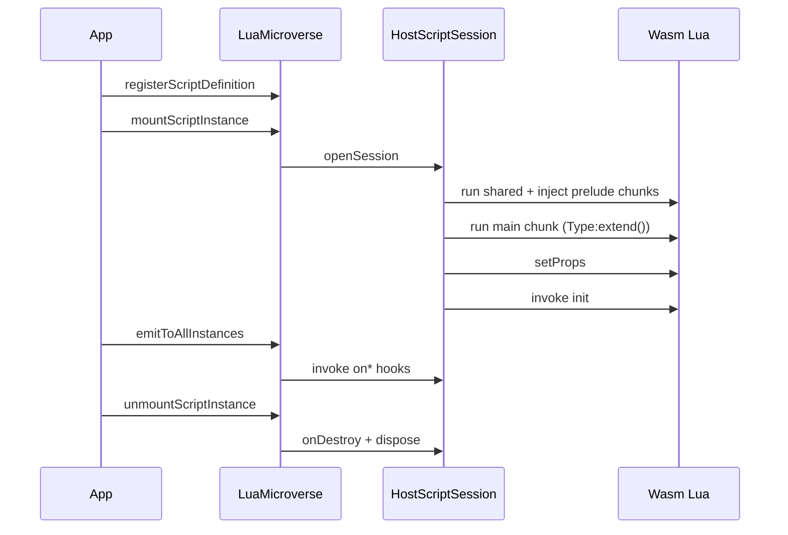

# `@microverse.ts/microverse-lua`

**Lua microverse** facade for TypeScript applications: `MicroverseLua.create`, Wasm VM, script slots, and the fluent host surface builder.

This package implements the **`lua@1`** script profile of the [Microverse protocol](../../spec/README.md). It is not the protocol itself — use `surface.toProtocolJson()` for the language-neutral `SurfaceSpec` export.

Monorepo overview: [root README](../../README.md). Meta-repo layout: [META.md](../../META.md).

## What is a Lua microverse?

One logical scripting universe in your process:

- **One** Wasm-backed Lua VM (Wasmoon), shared for efficiency.
- **Many** isolated **environment slots** — one per mounted script instance.
- **One** host **surface** (declarative bridges + optional component hooks).
- **One** host **object** (your TypeScript services).
- **Typed component profiles** — bridges on `self.bridges` are narrowed by `YourType:extend()` in each script.

```
┌─────────────────────────────────────────────────────────────┐
│  LuaMicroverse (MicroverseLua.create)                       │
│  ┌───────────────────────────────────────────────────────┐  │
│  │  Shared Wasm Lua VM                                   │  │
│  │  ┌─────────────┐ ┌─────────────┐ ┌─────────────┐     │  │
│  │  │ slot: a     │ │ slot: b     │ │ slot: c     │     │  │
│  │  │ OrderEcho   │ │ AuditOnly   │ │ Promotions  │     │  │
│  │  └─────────────┘ └─────────────┘ └─────────────┘     │  │
│  └───────────────────────────────────────────────────────┘  │
│         ▲ self.bridges after Type:extend() (per profile)    │
└─────────────────────────────────────────────────────────────┘
```

## Install

```bash
pnpm add @microverse.ts/microverse-lua
```

Workspace: `"@microverse.ts/microverse-lua": "workspace:*"`.

## Concepts

| Term | Meaning |
|------|---------|
| **Microverse** | One shared Wasm Lua VM + catalog of script definitions + N mounted instances ([`LuaMicroverse`](src/infrastructure/facade/luaMicroverse.ts)). |
| **Host** | Your typed services object passed to `MicroverseLua.create({ host })`. Handlers on the surface receive it; Lua never sees the raw host table. |
| **Surface** | Result of `defineHostSurfaceFor<THost>().componentType(…).bridge(…).method(…).componentHooks(…).build()` — component types, bridges, capability ids, and a manifest for `.d.lua`. |
| **Component type** | Declared profile: props/state Zod schemas, capability set, hook subset. Lua fixes the type with `OrderEcho:extend()` → `OrderEchoComponent`. |
| **Bridge** | A named group of host methods exposed in Lua as `self.bridges.<name>:<method>(payload)` when the active type’s capabilities include that method. **Not** a global in the script slot. |
| **Capability** | A `domain:action` string on each bridge method (`requires`) and on each `.componentType(…)` profile. Runtime includes only matching bridges on `self.bridges`. |
| **Script definition** | Catalog entry: `scriptId`, Lua source, optional `injectLuaChunks`, optional `profileId`, optional props schema / defaults. |
| **Script instance** | A mounted slot: `instanceId`, `scriptId`, props, and the component table from `YourType:extend()` in the script chunk. |
| **Component** | Lua table from `YourType:extend()` with typed `properties`, `state`, narrowed `bridges`, lifecycle (`init`, `onDestroy`, `onPropsChanged`), and domain `on*` hooks. |

## Engine lifecycle

When you mount an instance, the runtime runs this pipeline (see [`mountScriptInstance`](src/infrastructure/facade/luaMicroverse.ts)):



1. **`registerScriptDefinition`** — Add source to the catalog (does not allocate a slot).
2. **`mountScriptInstance`** — Open a slot, run preludes + main chunk, merge props, call `init`.
3. **`emitToAllInstances`** — Broadcast a component hook (`OrderPlaced`, …) to every mounted instance.
4. **`unmountScriptInstance`** — Call `onDestroy`, tear down the slot.
5. **`dispose`** — Unmount all instances.

## API

| Export / method | Purpose |
|-----------------|--------|
| `MicroverseLua.create` | Create a Lua microverse (Wasm VM included). |
| `registerScriptDefinition` | Catalog entry (source, optional preludes, props schema). |
| `mountScriptInstance` | New Wasm slot for one instance (props, audit). Script must call `Type:extend()`. |
| `unmountScriptInstance` | Tear down one instance. |
| `emitToAllInstances` | Call `on{Kind}` on every mounted instance (component hooks). |
| `setInstanceProps` / `patchInstanceProps` | Update host-synced props; may invoke `onPropsChanged`. |
| `getInstanceProps` / `flushInstanceProps` | Read or flush props proxy state. |
| `getSurfaceCapabilities` | All capability ids declared on the surface. |
| `surface.getComponentType(name)` | Resolved profile (props, state, capabilities, hooks) for codegen/runtime. |
| `dispose` | Unmount all instances. |
| `defineHostSurfaceFor`, `defineHostSurface` | Fluent surface builder (`componentType` → `bridge` → `method` → `build`). |

Re-exported from this package for convenience; lower-level session API lives in `@microverse.ts/host-surface`.

## Quick start (minimal)

```ts
import { MicroverseLua, defineHostSurfaceFor } from '@microverse.ts/microverse-lua';
import { z } from 'zod';

type MyHost = { appName: string };

const surface = defineHostSurfaceFor<MyHost>()
  .bridge('greet')
  .method('hello', {
    requires: 'demo:greet',
    input: z.object({ name: z.string() }),
    output: z.string(),
    handler: ({ host }, { name }) => `Hello, ${name} from ${host.appName}`,
  })
  .build();

const microverse = MicroverseLua.create({
  host: { appName: 'Acme' },
  surface,
  defaultTimeoutMs: 30_000,
});

microverse.registerScriptDefinition({
  scriptId: 'welcome',
  source: `local msg = greet:hello({ name = "world" })`,
});
await microverse.mountScriptInstance({
  instanceId: 'welcome',
  scriptId: 'welcome',
});

await microverse.dispose();
```

> The minimal sample uses a global `greet` table for brevity. In production, declare **`.componentType(…)`** on the surface, call **`YourType:extend()`** in Lua, and use **`self.bridges`** (see [Lua authoring](#lua-authoring) and [Integrating in your app](#integrating-in-your-app)).

## Integrating in your app

The reference layout is [`examples/sorting-lab`](../../examples/sorting-lab). File tour: [example README](../../examples/sorting-lab/README.md).

### 1. Define the host

Aggregate your real services into one object the surface handlers receive:

```ts
// examples/sorting-lab/src/engine/sortingLabHost.ts
export type SortingLabHost = {
  arrayA: number[];
  arrayB: number[];
  vizA: SortingVizSnapshot;
  vizB: SortingVizSnapshot;
  // …
};
```

Construct it in your app and pass it to `MicroverseLua.create({ host, surface })`.

### 2. Define the surface

Declare bridges (Lua → host), Zod payloads, capabilities, and optional component hooks (host → Lua):

```ts
// examples/sorting-lab/src/engine/sortingSurface.ts
import { defineHostSurfaceFor } from '@microverse.ts/microverse-lua';
import { sortingComponentHooks } from './sortingHooks';

export default defineHostSurfaceFor<SortingLabHost>()
  .componentType('SortingAlgorithm', SORTING_ALGORITHM_PROFILE)
  .bridge('array')
  .method('length', { requires: 'array:read', /* … */ })
  // … viz, sort bridges …
  .componentHooks(sortingComponentHooks)
  .build();
```

- **`componentType`** — Props/state schemas, capability set, and hook subset for `Name:extend()`.
- **`requires`** — Capability id; only methods whose capability is in the active type appear on `self.bridges`.
- **`handler`** — Runs in TypeScript with `{ host, script }` context.
- **`componentHooks`** — Map of event kind → Zod object; generates `onOrderPlaced`, `MicroverseEvt_OrderPlaced`, etc. in `.d.lua`.

Default-export the built surface for `microverse codegen --surface …`.

### 3. Wrap the engine (optional)

A thin façade keeps app code free of microverse details:

```ts
// examples/sorting-lab/src/engine/sortingLabEngine.ts
this.microverse = MicroverseLua.create({ host, surface, defaultTimeoutMs: 30_000 });

await this.microverse.mountScriptInstance({
  instanceId: 'A',
  scriptId: 'bubble_sort',
  profileId: 'SortingAlgorithm',
  props: { label: 'Bubble sort', slotSide: 'A' },
});

await session.invokeComponentHook(luaGlobalHookName('Tick'), { step: 1 });
```

Map your domain events to `emitToAllInstances` (see `dispatch` in the example).

### 4. Load Lua sources

Keep scripts in `.lua` files and register by `scriptId`:

```ts
import { readComponentLua } from './services/components/loadComponentScript';

engine.registerScriptDefinition('order_echo', readComponentLua('components/order_echo.lua'));
```

Or inline strings for tests. Use **`sharedLuaChunks`** on `create` for libraries shared by every instance (e.g. `lua/lib/math_helpers.lua`), and **`injectLuaChunks`** per definition or mount for one-off preludes.

### 5. Mount instances

Each Lua script chooses its profile with **`YourType:extend()`** at load time. `self.bridges` only contains bridges/methods allowed by that type’s capabilities:

```ts
await engine.mountScriptInstance({
  scriptId: 'billing_denied',
  props: { maxCents: 1000 },
});
```

```lua
-- billing_denied.lua — AuditOnly type has no billing bridge
local C = AuditOnly:extend()
```

Optional **`audit`** metadata is passed to script audit callbacks for observability.

### 6. Dispatch events and shut down

```ts
await engine.emitHook('OrderPlaced', payload);
// or engine.dispatch(domainEvent)

await engine.dispose();
```

## Lua authoring

### Component pattern

Scripts call the **type singleton** declared on the surface (e.g. `OrderEcho:extend()`) and implement hooks on the returned table:

```lua
-- examples/sorting-lab/lua/bubble_sort.lua
local C = SortingAlgorithm:extend()

function C:onTick(_evt)
  self.bridges.viz:markComparing({ a = j, b = j + 1 })
  -- one compare/swap per tick …
end
```

- **`OrderEcho:extend()`** — Builds the instance with typed `properties`, `state`, and narrowed `bridges` for that profile.
- **Domain events** — Implement `onOrderPlaced`, … listed in the type’s `hooks` (and in `OrderEchoComponent` in `.d.lua`).
- **Lifecycle** — `init`, `onDestroy`, `onPropsChanged` (see `props_demo.lua`).

### Bridges (scoped, not global)

Call host APIs through **`self.bridges.<bridgeName>:<method>(payload)`**:

```lua
local order = self.bridges.orders:get({ orderId = evt.orderId })
self.bridges.audit:record({ line = "seen:" .. evt.orderId })
```

Bridge names match `.bridge('orders')` in TypeScript (camelCase field on `OrderEchoBridges` / your type’s bridges class in `.d.lua`).

### Props and state

```lua
-- examples/business-scripting-engine/lua/components/props_demo.lua
function C:init()
  self.state = { hits = 0 }
end

function C:onPropsChanged(key, newValue)
  self.state.lastKey = key
end

function C:onOrderPlaced(evt)
  local label = self.properties.label or "?"
  self.state.hits = (self.state.hits or 0) + 1
end
```

Host patches props via `setInstanceProps` / `patchInstanceProps` on the microverse.

### Shared Lua libraries

| Mechanism | Scope |
|-----------|--------|
| `sharedLuaChunks` on `MicroverseLua.create` | Every instance, every mount |
| `injectLuaChunks` on `registerScriptDefinition` | All mounts of that `scriptId` |
| `injectLuaChunks` on `mountScriptInstance` | Single instance |

Run order: shared → definition → mount preludes → main script chunk.

### Async bridges

Mark a handler `async` in TypeScript; Lua may use a completion callback or `:await()` on the returned handle:

```lua
-- examples/business-scripting-engine/lua/components/order_asyncio_tick.lua
self.bridges.asyncio:tick({ delayMs = 5, seed = evt.amountCents }, function(r)
  self.bridges.audit:record({ line = "asyncio-value:" .. tostring(r.value) })
end)
```

Generated stubs document `AsyncioTickHandle` and `AsyncioTickResult` for LuaLS.

## IDE typing (LuaCATS)

Generate stubs from the same surface module that drives runtime:

```bash
pnpm add -D @microverse.ts/cli
pnpm exec microverse codegen --surface src/engine/sortingSurface.ts
```

The manifest emits **type-only** bridge classes (`---@class Orders` + `---@field get fun(…)`) so LuaLS does not treat `Orders` as a runtime global. Use:

- `self.bridges.orders` — field name (camelCase) on `OrderEchoBridges` (per component type)
- Types like `Orders`, `OrderDto` — PascalCase classes in the stub file
- `OrderEcho:extend()` — singleton stub per `.componentType('OrderEcho', …)`

Point LuaLS at the generated folder and list your type singletons as globals:

```json
{
  "workspace.library": ["./generated"],
  "diagnostics.globals": ["OrderEcho", "AuditOnly", "Promotions"]
}
```

Include both `sortingSurface.d.lua` (bridges + `*Component`) and `sortingScriptCatalog.d.lua` (per-`scriptId` aliases) when using a script catalog.

See [`examples/sorting-lab/.luarc.json`](../../examples/sorting-lab/.luarc.json) and [`generated/sortingSurface.d.lua`](../../examples/sorting-lab/generated/sortingSurface.d.lua).

**Chess duel (shared board, turn-based):** [`examples/chess-lab`](../examples/chess-lab/README.md) — two `ChessEngine` scripts compete on one `chess.js` board.

Details: [`@microverse.ts/cli`](../cli/README.md), [`@microverse.ts/lua-defs`](../lua-defs/README.md).

## Integrating a game engine (script profiles)

For ECS-style hosts (many entities, many scripts, YAML-driven props), use **script profiles** instead of declaring every script on the surface:

| Primitive | Role |
|-----------|------|
| `LuaScriptDefinition.profileId` | Names a profile (usually matches a `.componentType()` on the surface for bridges/codegen). |
| `mountScriptInstance({ profileId })` | Host applies the profile at `openSession` — Lua chunks can omit `Type:extend()` for runtime (keep `---@type XxxComponent` for LuaLS). |
| `HostScriptSession` + `createLuaEnvSlotKey('entity::script')` | One slot per entity+script; your subsystem owns reconcile/lifecycle. |
| `ScriptReferenceResolver` | Implement `self.references.*` wrappers (entity handles) without ECS types in microverse. |
| `buildScriptCatalogLuaDefManifest` | Emit per-`scriptId` aliases for `lua/` (see business example). |

Reference layout: [`examples/sorting-lab/src/engine/sortingScriptCatalog.ts`](../../examples/sorting-lab/src/engine/sortingScriptCatalog.ts).

## Security model

| Layer | Behavior |
|-------|----------|
| **Component types** | Each `.componentType(…)` declares a capability set. `Type:extend()` mounts only matching bridges on `self.bridges`; other bridges are absent (`nil`). |
| **Bridge methods** | Each method declares `requires`; filtering happens at extend time, not per call (no `capability denied` throws). |
| **Host isolation** | The TypeScript `host` object is not injected into Lua; only bridge tables built from the surface are visible (via `self.bridges`). |
| **Timeouts** | `defaultTimeoutMs` or `defaultTimeout` on `create`; Wasm instruction budget in `@microverse.ts/runtime-wasm`. |
| **Validation** | Zod validates bridge inputs/outputs and instance props (per active type) at the TS boundary (`@microverse.ts/runtime-zod`). |

## Related packages

| Package | Use when |
|---------|----------|
| [`@microverse.ts/host-surface`](../host-surface/README.md) | Surface builder details, `HostScriptSession`, custom slot wiring. |
| [`@microverse.ts/lua-defs`](../lua-defs/README.md) | Manifest → LuaCATS document (library use). |
| [`@microverse.ts/cli`](../cli/README.md) | `microverse codegen` in CI or locally. |
| `runtime-wasm`, `runtime-bridge`, `runtime-capabilities` | Advanced runtime customization (usually via host-surface). |

## Reference example

[`examples/sorting-lab`](../../examples/sorting-lab) — browser sorting comparator: Wasm Lua, tick-by-tick `onTick`, dual panels, and `SortingLabEngine` wrapping this package.

```bash
pnpm --filter @microverse.ts/sorting-lab test
pnpm --filter @microverse.ts/sorting-lab dev
```
