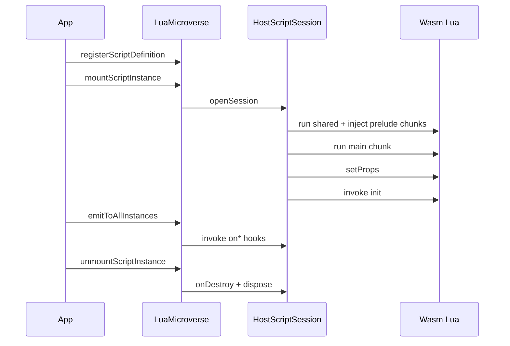

# `@microverse.ts/microverse-lua`

**Lua microverse** facade for TypeScript applications: `MicroverseLua.create`, Wasm VM, script slots, and the fluent host surface builder.

Monorepo overview (protocol vision): [root README](../../README.md).

## What is a Lua microverse?

One logical scripting universe in your process:

- **One** Wasm-backed Lua VM (Wasmoon), shared for efficiency.
- **Many** isolated **environment slots** — one per mounted script instance.
- **One** host **surface** (declarative bridges + optional component hooks).
- **One** host **object** (your TypeScript services).
- **Per-instance capability allowlists** at mount.

```
┌─────────────────────────────────────────────────────────────┐
│  LuaMicroverse (MicroverseLua.create)                       │
│  ┌───────────────────────────────────────────────────────┐  │
│  │  Shared Wasm Lua VM                                   │  │
│  │  ┌─────────────┐ ┌─────────────┐ ┌─────────────┐     │  │
│  │  │ slot: a     │ │ slot: b     │ │ slot: c     │     │  │
│  │  │ caps: […]   │ │ caps: […]   │ │ caps: […]   │     │  │
│  │  └─────────────┘ └─────────────┘ └─────────────┘     │  │
│  └───────────────────────────────────────────────────────┘  │
│         ▲ bridges via self.bridges (scoped per instance)    │
└─────────────────────────────────────────────────────────────┘
```

## Install

```bash
pnpm add @microverse.ts/microverse-lua
```

Workspace: `"@microverse.ts/microverse-lua": "workspace:*"`.

## Concepts

| Term | Meaning |
|------|---------|
| **Microverse** | One shared Wasm Lua VM + catalog of script definitions + N mounted instances ([`LuaMicroverse`](src/infrastructure/facade/luaMicroverse.ts)). |
| **Host** | Your typed services object passed to `MicroverseLua.create({ host })`. Handlers on the surface receive it; Lua never sees the raw host table. |
| **Surface** | Result of `defineHostSurfaceFor<THost>().bridge(…).method(…).componentHooks(…).build()` — bridges, capability ids, and a manifest for `.d.lua`. |
| **Bridge** | A named group of host methods exposed in Lua as `self.bridges.<name>:<method>(payload)`. **Not** a global in the script slot. |
| **Capability** | A `domain:action` string declared on each bridge method (`requires`). Each instance mounts with an allowlist (`surface.pickCapabilities(…)`). |
| **Script definition** | Catalog entry: `scriptId`, Lua source, optional `injectLuaChunks`, optional props schema / defaults. |
| **Script instance** | A mounted slot: `instanceId`, `scriptId`, capabilities, props, and the active component table from `component:extend()`. |
| **Component** | Lua table from `component:extend()` with `properties`, `state`, `bridges`, lifecycle (`init`, `onDestroy`, `onPropsChanged`), and domain `on*` hooks. |

## Engine lifecycle

When you mount an instance, the runtime runs this pipeline (see [`mountScriptInstance`](src/infrastructure/facade/luaMicroverse.ts)):



1. **`registerScriptDefinition`** — Add source to the catalog (does not allocate a slot).
2. **`mountScriptInstance`** — Open a slot, run preludes + main chunk, merge props, call `init`.
3. **`emitToAllInstances`** — Broadcast a component hook (`OrderPlaced`, …) to every mounted instance.
4. **`unmountScriptInstance`** — Call `onDestroy`, tear down the slot.
5. **`dispose`** — Unmount all instances.

## API

| Export / method | Purpose |
|-----------------|--------|
| `MicroverseLua.create` | Create a Lua microverse (Wasm VM included). |
| `registerScriptDefinition` | Catalog entry (source, optional preludes, props schema). |
| `mountScriptInstance` | New Wasm slot for one instance (capabilities, props, audit). |
| `unmountScriptInstance` | Tear down one instance. |
| `emitToAllInstances` | Call `on{Kind}` on every mounted instance (component hooks). |
| `setInstanceProps` / `patchInstanceProps` | Update host-synced props; may invoke `onPropsChanged`. |
| `getInstanceProps` / `flushInstanceProps` | Read or flush props proxy state. |
| `getSurfaceCapabilities` | All capability ids declared on the surface. |
| `surface.pickCapabilities(…)` | Build an allowlist for `mountScriptInstance`. |
| `dispose` | Unmount all instances. |
| `defineHostSurfaceFor`, `defineHostSurface` | Fluent surface builder (`bridge` → `method` → `build`). |

Re-exported from this package for convenience; lower-level session API lives in `@microverse.ts/host-surface`.

## Quick start (minimal)

```ts
import { MicroverseLua, defineHostSurfaceFor } from '@microverse.ts/microverse-lua';
import { z } from 'zod';

type MyHost = { appName: string };

const surface = defineHostSurfaceFor<MyHost>()
  .bridge('greet')
  .method('hello', {
    requires: 'demo:greet',
    input: z.object({ name: z.string() }),
    output: z.string(),
    handler: ({ host }, { name }) => `Hello, ${name} from ${host.appName}`,
  })
  .build();

const microverse = MicroverseLua.create({
  host: { appName: 'Acme' },
  surface,
  defaultTimeoutMs: 30_000,
});

microverse.registerScriptDefinition({
  scriptId: 'welcome',
  source: `local msg = greet:hello({ name = "world" })`,
});
await microverse.mountScriptInstance({
  instanceId: 'welcome',
  scriptId: 'welcome',
  capabilities: surface.pickCapabilities('demo:greet'),
});

await microverse.dispose();
```

> The minimal sample uses a global `greet` table for brevity. In production, use **`component:extend()`** and **`self.bridges`** (see [Lua authoring](#lua-authoring) and [Integrating in your app](#integrating-in-your-app)).

## Integrating in your app

The reference layout is [`examples/business-scripting-engine`](../../examples/business-scripting-engine). File tour: [example README](../../examples/business-scripting-engine/README.md).

### 1. Define the host

Aggregate your real services into one object the surface handlers receive:

```ts
// examples/business-scripting-engine/src/services/businessEngineHost.ts
export type BusinessEngineHost = {
  readonly orders: OrdersService;
  readonly billing: BillingService;
  // …
};
```

Construct it in your app and pass it to `MicroverseLua.create({ host, surface })`.

### 2. Define the surface

Declare bridges (Lua → host), Zod payloads, capabilities, and optional component hooks (host → Lua):

```ts
// examples/business-scripting-engine/src/businessSurface.ts
import { defineHostSurfaceFor } from '@microverse.ts/microverse-lua';
import { businessComponentHooks } from './schemas/components/businessComponentHooks';

export default defineHostSurfaceFor<BusinessEngineHost>()
  .bridge('orders')
  .method('get', {
    requires: 'orders:read',
    input: z.object({ orderId }),
    output: orderDto.optional(),
    handler: ({ host }, { orderId }) => host.orders.get(orderId),
  })
  // … more bridges …
  .componentHooks(businessComponentHooks)
  .build();
```

- **`requires`** — Capability id enforced at runtime for this method.
- **`handler`** — Runs in TypeScript with `{ host, script }` context.
- **`componentHooks`** — Map of event kind → Zod object; generates `onOrderPlaced`, `MicroverseEvt_OrderPlaced`, etc. in `.d.lua`.

Default-export the built surface for `microverse generate-lua-defs --surface …`.

### 3. Wrap the engine (optional)

A thin façade keeps app code free of microverse details:

```ts
// examples/business-scripting-engine/src/BusinessScriptingEngine.ts
this.microverse = MicroverseLua.create({ host, surface, defaultTimeoutMs: 30_000 });

await this.microverse.mountScriptInstance({
  instanceId: 'promo-1',
  scriptId: 'promotions',
  capabilities: surface.pickCapabilities('orders:read', 'audit:record'),
  props: { label: 'summer-sale' },
});

await this.microverse.emitToAllInstances('OrderPlaced', { orderId, amountCents, customerId });
```

Map your domain events to `emitToAllInstances` (see `dispatch` in the example).

### 4. Load Lua sources

Keep scripts in `.lua` files and register by `scriptId`:

```ts
import { readComponentLua } from './services/components/loadComponentScript';

engine.registerScriptDefinition('order_echo', readComponentLua('components/order_echo.lua'));
```

Or inline strings for tests. Use **`sharedLuaChunks`** on `create` for libraries shared by every instance (e.g. `lua/lib/math_helpers.lua`), and **`injectLuaChunks`** per definition or mount for one-off preludes.

### 5. Mount instances

Each instance needs a **capability allowlist** — only declared methods on allowed bridges are callable from Lua:

```ts
await engine.mountScriptInstance({
  scriptId: 'billing_denied',
  capabilities: surface.pickCapabilities('billing:charge', 'audit:record'),
  props: { maxCents: 1000 },
});
```

Optional **`audit`** metadata is passed to script audit callbacks for observability.

### 6. Dispatch events and shut down

```ts
await engine.emitHook('OrderPlaced', payload);
// or engine.dispatch(domainEvent)

await engine.dispose();
```

## Lua authoring

### Component pattern

Scripts use the injected **`component`** helper and implement hooks on the returned table:

```lua
-- examples/business-scripting-engine/lua/components/order_echo.lua
local C = component:extend()

function C:onOrderPlaced(evt)
  self.bridges.notifications:send({
    channel = "echo",
    message = "order:" .. evt.orderId,
  })
end
```

- **`component:extend()`** — Builds the instance with `properties`, `state`, and `bridges` for this slot.
- **Domain events** — Implement `onOrderPlaced`, `onInventoryLow`, … matching `.componentHooks()` on the surface.
- **Lifecycle** — `init`, `onDestroy`, `onPropsChanged` (see `props_demo.lua`).

### Bridges (scoped, not global)

Call host APIs through **`self.bridges.<bridgeName>:<method>(payload)`**:

```lua
local order = self.bridges.orders:get({ orderId = evt.orderId })
self.bridges.audit:record({ line = "seen:" .. evt.orderId })
```

Bridge names match `.bridge('orders')` in TypeScript (camelCase field on `MicroverseBridges` in `.d.lua`).

### Props and state

```lua
-- examples/business-scripting-engine/lua/components/props_demo.lua
function C:init()
  self.state = { hits = 0 }
end

function C:onPropsChanged(key, newValue)
  self.state.lastKey = key
end

function C:onOrderPlaced(evt)
  local label = self.properties.label or "?"
  self.state.hits = (self.state.hits or 0) + 1
end
```

Host patches props via `setInstanceProps` / `patchInstanceProps` on the microverse.

### Shared Lua libraries

| Mechanism | Scope |
|-----------|--------|
| `sharedLuaChunks` on `MicroverseLua.create` | Every instance, every mount |
| `injectLuaChunks` on `registerScriptDefinition` | All mounts of that `scriptId` |
| `injectLuaChunks` on `mountScriptInstance` | Single instance |

Run order: shared → definition → mount preludes → main script chunk.

### Async bridges

Mark a handler `async` in TypeScript; Lua may use a completion callback or `:await()` on the returned handle:

```lua
-- examples/business-scripting-engine/lua/components/order_asyncio_tick.lua
self.bridges.asyncio:tick({ delayMs = 5, seed = evt.amountCents }, function(r)
  self.bridges.audit:record({ line = "asyncio-value:" .. tostring(r.value) })
end)
```

Generated stubs document `AsyncioTickHandle` and `AsyncioTickResult` for LuaLS.

## IDE typing (LuaCATS)

Generate stubs from the same surface module that drives runtime:

```bash
pnpm add -D @microverse.ts/cli
pnpm exec microverse generate-lua-defs --surface src/businessSurface.ts
```

The manifest emits **type-only** bridge classes (`---@class Orders` + `---@field get fun(…)`) so LuaLS does not treat `Orders` as a runtime global. Use:

- `self.bridges.orders` — field name (camelCase) on `MicroverseBridges`
- Types like `Orders`, `OrderDto` — PascalCase classes in the stub file

Point LuaLS at the generated folder:

```json
{
  "workspace.library": ["./generated"],
  "diagnostics.globals": ["component"]
}
```

See [`examples/business-scripting-engine/.luarc.json`](../../examples/business-scripting-engine/.luarc.json) and [`generated/businessSurface.d.lua`](../../examples/business-scripting-engine/generated/businessSurface.d.lua).

Details: [`@microverse.ts/cli`](../cli/README.md), [`@microverse.ts/lua-defs`](../lua-defs/README.md).

## Security model

| Layer | Behavior |
|-------|----------|
| **Capabilities** | Each bridge method declares `requires`. Calls from Lua are denied unless the instance’s allowlist includes that capability. |
| **Per-instance allowlist** | `mountScriptInstance({ capabilities: surface.pickCapabilities(…) })` — principle of least privilege per script. |
| **Host isolation** | The TypeScript `host` object is not injected into Lua; only bridge tables built from the surface are visible (via `self.bridges`). |
| **Timeouts** | `defaultTimeoutMs` or `defaultTimeout` on `create`; Wasm instruction budget in `@microverse.ts/runtime-wasm`. |
| **Validation** | Zod validates bridge inputs and outputs at the TS boundary (`@microverse.ts/runtime-zod`). |

## Related packages

| Package | Use when |
|---------|----------|
| [`@microverse.ts/host-surface`](../host-surface/README.md) | Surface builder details, `HostScriptSession`, custom slot wiring. |
| [`@microverse.ts/lua-defs`](../lua-defs/README.md) | Manifest → LuaCATS document (library use). |
| [`@microverse.ts/cli`](../cli/README.md) | `microverse generate-lua-defs` in CI or locally. |
| `runtime-wasm`, `runtime-bridge`, `runtime-capabilities` | Advanced runtime customization (usually via host-surface). |

## Reference example

[`examples/business-scripting-engine`](../../examples/business-scripting-engine) — orders, billing, notifications, audit, inventory, jobs, component Lua, and `BusinessScriptingEngine` wrapping this package.

```bash
pnpm --filter @microverse.ts/business-scripting-engine test
```
